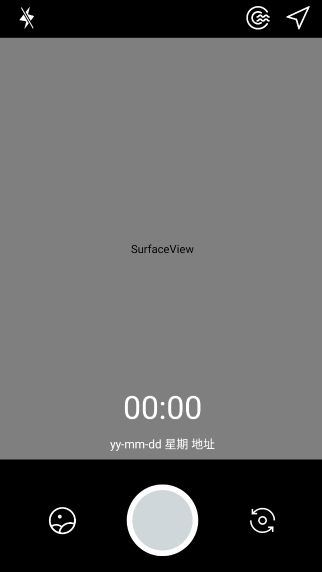
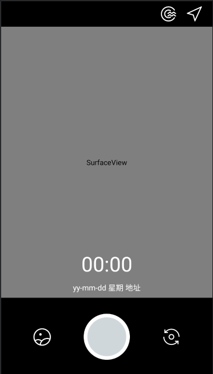
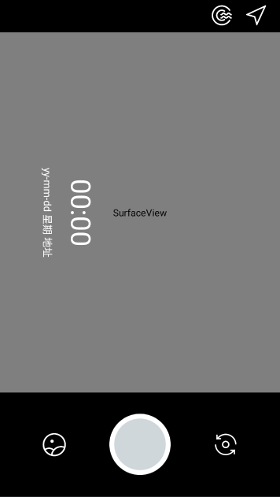
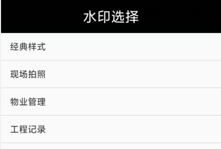
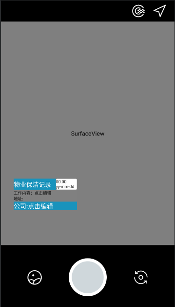
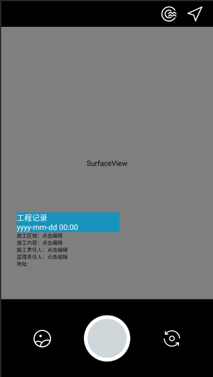

# camera
## 1.设计目的
水印相机是一款拍摄美化类手机软件，拥有丰富的水印类型及模板和新颖有趣的玩法，在用户分享的照片基础上印上地理位置、天气、心情、当前时间等情况，甚至周围声音分贝数等信息。
## 2.开发环境
### 2.1硬件环境
操作系统： Windows 10，CPU 2.0G以上，内存16G以上，硬盘1T以上
### 2.2软件环境
开发平台：Android Studio
开发语言：Kotlin
## 3.功能设计
水印相机的具体功能如下：
1)	可以切换不同水印样式；
2)	横竖屏切换时可以同步更改水印位置；
3)	可以更改定位地点细节；
4)	可以开关闪光灯；
5)	可以切换前后摄像头；
6)	简单相册功能；
7)	可用双指放大缩小；
8)	自动对焦；     

## 4.效果
界面设计：       

      
竖屏水印：       

      
横屏水印：       

      

水印样式选择：       

      
物业：       

      
界面：       

   

工程记录；      

       

